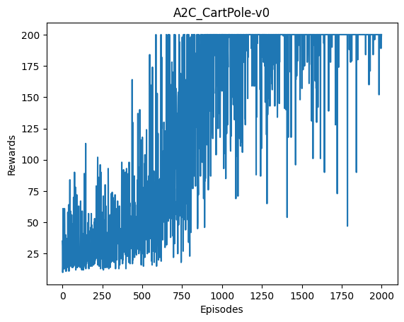

# ReiLLi

ReiLLi is a PyTorch project that consists of easy-to-understand and reliable implementations of several Model-Free Reinforcement Learning algorithms. The project is primarily intended for beginners to help them understand and conveniently use Model-Free RL algorithms  for training agents  that can perform optimally in several popular OpenAI gym environments. However, I beilieve that the project can also be utilized for more complex purposes, though that might require some changes in the original code. 

## Algorithms
The following algorithms are implemented in this project:
- Deep Q-Learning with discrete action space
- Double Deep Q-Learning with discrete action space
- REINFORCE with discrete action space
- A2C with discrete action space
- PPO with both discrete and continuous action space
- DDPG with continuous action space
- TD3 with discretized action space
- SAC with continuous action space

## Usage
- The 'examples' folder contains example files for every algorithm. These examples can be followed to use any algorithm for training agents for environments of one's choice.
- The train function is used for training the agent and the test function is used for testing the trained agent. The test function can also be used to run pre-trained agents using the dict files stored in the 'models' folder.
- The model_dir argument in the 'train' and 'test' functions allows one to save the weights of the trained agent and also use it at test-time. Furthermore, one can also use the plot_dir argument in the 'train' function to save reward plots for the training. The only caveat while using plot_dir is that the training will run for as many episodes as defined for the num_episodes argument.

## Results
The code was tested on the following algorithms:
- LunarLander-v2
- Cartpole-v0
- LunarLanderConitnuous-v2
- BipedalWalker-v3
The project is specifically written for OpenAI gym environments with vector representations for states.

| REINFORCE CartPole-v0  | A2C CartPole-v0 |
| :-------------------------:|:-------------------------: |
|  |   |

| DQL LunarLander-v2  | DDQL LunarLander-v2 |
| :-------------------------:|:-------------------------: |
|  |   |

| PPO CartPole-v0  | PPO LunarLander-v2 |
| :-------------------------:|:-------------------------: |
|  |   |

